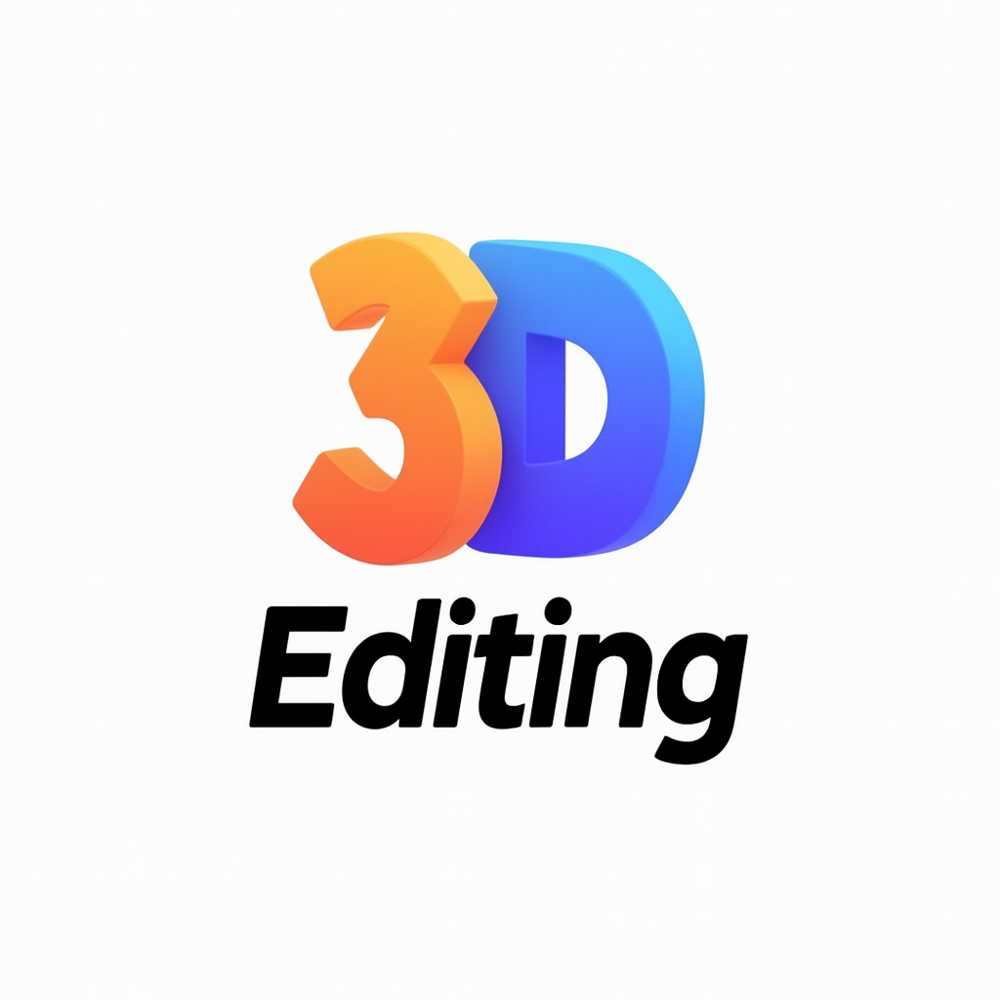

<p align="center">
  <h1 align="center"> <b> Awesome 3D Editing</b></h1> 
</p>


<div align="center">
  
  <h3>🎨 A Curated Collection of 3D Editing Resources</h3>
  <p>Comprehensive collection of cutting-edge 3D editing papers, implementations, tools, and datasets</p>
</div>

---

<!-- **Language Versions**: **English** | [中文](README-zh.md) -->

---

## 📖 Table of Contents

- [📖 Table of Contents](#-table-of-contents)
- [📚 Survey Papers](#-survey-papers)
	- [2025](#2025)
	- [2023](#2023)
- [🔬 Core Technologies](#-core-technologies)
	- [Object Editing](#object-editing)
	- [Scene Editing](#scene-editing)
	- [Human Editing](#human-editing)
	- [Texture \& Material Editing](#texture--material-editing)
- [🎯 Application Domains](#-application-domains)
	- [Human Editing](#human-editing-1)
		- [Face Editing](#face-editing)
		- [Body Editing](#body-editing)
	- [Scene Editing](#scene-editing-1)
		- [Indoor Scenes](#indoor-scenes)
		- [Outdoor Scenes](#outdoor-scenes)
	- [Object Editing](#object-editing-1)
		- [Single Object Editing](#single-object-editing)
		- [Multi-Object Editing](#multi-object-editing)
	- [Texture Editing](#texture-editing)
	- [Animation Editing](#animation-editing)
- [🛠️ Tools \& Software](#️-tools--software)
	- [Open Source Tools](#open-source-tools)
		- [General 3D Editing Tools](#general-3d-editing-tools)
		- [Neural Rendering Tools](#neural-rendering-tools)
	- [Commercial Software](#commercial-software)
	- [Web Tools](#web-tools)
- [📊 Datasets](#-datasets)
	- [3D Object Datasets](#3d-object-datasets)
	- [3D Scene Datasets](#3d-scene-datasets)
	- [Human Datasets](#human-datasets)
- [🔗 Related Resources](#-related-resources)
	- [Related Awesome Lists](#related-awesome-lists)
- [🤝 Contributing](#-contributing)
	- [How to Contribute](#how-to-contribute)
	- [Contribution Types](#contribution-types)
	- [Submission Format](#submission-format)
- [📄 License](#-license)
- [🌟 Acknowledgments](#-acknowledgments)
- [📈 Statistics](#-statistics)

---

## 📚 Survey Papers

### 2025
- **3D Content Generation and Editing: A Survey** [[Paper]](https://arxiv.org/abs/2401.17847) [[Project Page]](https://awesome-3d-editing.github.io/)
  - *Venue: arXiv 2024*
  - *Keywords: 3D Generation, Editing, Survey*

### 2023
- **Neural 3D Scene Reconstruction and Editing: A Survey** [[Paper]](https://arxiv.org/abs/2303.09505)
  - *Venue: arXiv 2023*
  - *Keywords: Scene Reconstruction, Neural Rendering*

---

## 🔬 Core Technologies

### Object Editing

- **RELATE3D: REfocusing Latent Adapter for Targeted local Enhancement and Editing in 3D Generation** [[Paper]](https://dl.acm.org/doi/pdf/10.1145/3721238.3730648)
  - *Venue: SIGGRAPH 2025*
  - *Keywords: 3D Object Editing*

- **Edit360: 2D Image Edits to 3D Assets from Any Angle** [[Paper]](https://arxiv.org/abs/2506.10507) [[Project Page]](https://edit360.github.io/)
  - *arXiv 2025*
  - *2D-to-3D multi-view object editing*

- **VoxHammer: Training-Free Precise and Coherent 3D Editing in Native 3D Space** [[Paper]](https://arxiv.org/abs/2508.19247) [[Project Page]](https://huanngzh.github.io/VoxHammer-Page/)
  - *arXiv 2025*
  - *Training-free precise object editing*

- **CMD: Controllable Multiview Diffusion for 3D Editing and Progressive Generation** [[Paper]](https://arxiv.org/abs/2505.07003) [[Project Page]](https://penghtyx.github.io/CMD/)
  - *arXiv 2025*
  - *Controllable multiview diffusion for object editing*

- **Point-E: A System for Generating 3D Point Clouds from Complex Prompts** [[Paper]](https://arxiv.org/abs/2212.08751)
  - *OpenAI*
  - *Text-driven point cloud object editing*

- **MeshDiffusion: Score-based Generative 3D Mesh Modeling** [[Paper]](https://arxiv.org/abs/2303.08133)
  - *ICLR 2023*
  - *Diffusion model-based mesh object editing*

### Scene Editing

- **EditNeRF: Editing Neural Radiance Fields** [[Paper]](https://arxiv.org/abs/2205.02784) [[Demo]](https://editnerf.github.io/)
  - *ICCV 2023*
  - *Breakthrough NeRF scene editing approach*

- **Instruct-NeRF2NeRF: Editing 3D Scenes with Instructions** [[Paper]](https://arxiv.org/abs/2303.12789) [[Project Page]](https://instruct-nerf2nerf.github.io/)
  - *ICCV 2023*
  - *Instruction-based scene editing*

- **LocalRF: Local Radiance Fields for Real-time Editing** [[Paper]](https://arxiv.org/abs/2303.09505)
- **DreamEditor: Text-Driven 3D Scene Editing with Neural Fields** [[Paper]](https://arxiv.org/abs/2306.13455)

### Human Editing

- **FaceEdit3D: 3D Face Editing with Generative Neural Fields** [[Paper]](https://arxiv.org/abs/2303.09505)
  - *ICCV 2023*
  - *3D face editing with neural fields*

- **HumanNeRF: Efficiently Generated Human Radiance Field from Sparse Inputs** [[Paper]](https://arxiv.org/abs/2201.04127)
  - *CVPR 2022*
  - *Human body editing with NeRF*

- **SMPL-X: A new joint 3D model of the human body, face and hands together** [[Paper]](https://arxiv.org/abs/1907.00847)
- **3D Face Reconstruction and Dense Alignment with Position Map Regression Network** [[Paper]](https://arxiv.org/abs/1803.07835)

### Texture & Material Editing

- **Text2Tex: Text-driven Texture Synthesis via Diffusion Models** [[Paper]](https://arxiv.org/abs/2303.11396)
  - *SIGGRAPH 2023*
  - *Text-driven texture synthesis*

- **TEXTure: Text-Guided Texturing of 3D Shapes** [[Paper]](https://arxiv.org/abs/2302.01721)
  - *SIGGRAPH 2023*
  - *Text-guided 3D shape texturing*

- **Neural Fields in Computer Graphics** [[Paper]](https://arxiv.org/abs/2303.09505)
  - *SIGGRAPH 2023 Course*
  - *Comprehensive introduction to material editing*

---

## 🎯 Application Domains

### Human Editing

#### Face Editing
- **FaceEdit3D: 3D Face Editing with Generative Neural Fields** [[Paper]](link) [[Code]](link)
- **3D Face Reconstruction and Dense Alignment with Position Map Regression Network** [[Paper]](link) [[Code]](link)

#### Body Editing
- **HumanNeRF: Efficiently Generated Human Radiance Field from Sparse Inputs** [[Paper]](link) [[Code]](link)
- **SMPL-X: A new joint 3D model of the human body, face and hands together** [[Paper]](link) [[Code]](link)

### Scene Editing

#### Indoor Scenes
- **SceneEdit: Indoor Scene Editing with Text Instructions** [[Paper]](link) [[Code]](link)
- **Room Layout Estimation from a Cubemap of Panorama Image via Deep Manhattan Heuristic** [[Paper]](link) [[Code]](link)

#### Outdoor Scenes
- **Urban Scene Editing via Neural Rendering** [[Paper]](link) [[Code]](link)

### Object Editing

#### Single Object Editing
- **ObjectNeRF: Neural Radiance Fields for Object Editing** [[Paper]](link) [[Code]](link)
- **DreamFusion: Text-to-3D using 2D Diffusion** [[Paper]](link) [[Code]](link)

#### Multi-Object Editing
- **Compositional 3D Scene Generation using Locally Conditioned Diffusion** [[Paper]](link) [[Code]](link)

### Texture Editing

- **Text2Tex: Text-driven Texture Synthesis via Diffusion Models** [[Paper]](link) [[Code]](link)
- **TEXTure: Text-Guided Texturing of 3D Shapes** [[Paper]](link) [[Code]](link)

### Animation Editing

- **MoFA: Model-based Deep Convolutional Face Autoencoder for Unsupervised Monocular Reconstruction** [[Paper]](link) [[Code]](link)
- **Neural 3D Animation Synthesis** [[Paper]](link) [[Code]](link)

---

## 🛠️ Tools & Software

### Open Source Tools

#### General 3D Editing Tools
| Tool Name                                            | Description                       | Language     | Stars                                                                       | Last Updated                                                                            |
| ---------------------------------------------------- | --------------------------------- | ------------ | --------------------------------------------------------------------------- | --------------------------------------------------------------------------------------- |
| [Blender](https://github.com/blender/blender)        | Powerful open-source 3D suite     | C/C++/Python |         |         |
| [MeshLab](https://github.com/cnr-isti-vclab/meshlab) | 3D mesh processing tool           | C++          |  |  |
| [Open3D](https://github.com/intel-isl/Open3D)        | Modern 3D data processing library | C++/Python   |        |        |

#### Neural Rendering Tools
| Tool Name                                                         | Description                     | Language | Stars                                                                                | Last Updated                                                                                     |
| ----------------------------------------------------------------- | ------------------------------- | -------- | ------------------------------------------------------------------------------------ | ------------------------------------------------------------------------------------------------ |
| [Nerfstudio](https://github.com/nerfstudio-project/nerfstudio)    | NeRF toolkit                    | Python   |    |    |
| [Instant-ngp](https://github.com/NVlabs/instant-ngp)              | NVIDIA instant neural graphics  | CUDA/C++ |               |               |
| [threestudio](https://github.com/threestudio-project/threestudio) | Unified 3D generation framework | Python   |  |  |

### Commercial Software

- **Maya** - Autodesk's professional 3D animation software
- **3ds Max** - Autodesk's 3D modeling and rendering software
- **Cinema 4D** - Maxon's professional 3D modeling software
- **Houdini** - SideFX's procedural 3D software
- **ZBrush** - Pixologic's digital sculpting software

### Web Tools

- **Three.js Editor** - Browser-based 3D editor
- **Spline** - Collaborative 3D design tool
- **Vectary** - Online 3D modeling tool

---

## 📊 Datasets

### 3D Object Datasets
| Dataset Name | Description                          | Scale                       | Download Link                              |
| ------------ | ------------------------------------ | --------------------------- | ------------------------------------------ |
| **ShapeNet** | Large-scale 3D shape dataset         | 55 categories, 51.3K models | [Link](https://shapenet.org/)              |
| **ModelNet** | 3D CAD model dataset                 | 40/10 categories            | [Link](https://modelnet.cs.princeton.edu/) |
| **PartNet**  | Fine-grained hierarchical 3D objects | 24 categories, 26.7K models | [Link](https://partnet.cs.stanford.edu/)   |

### 3D Scene Datasets
| Dataset Name     | Description          | Scale        | Download Link                                                                  |
| ---------------- | -------------------- | ------------ | ------------------------------------------------------------------------------ |
| **ScanNet**      | RGB-D video dataset  | 1513 scenes  | [Link](http://www.scan-net.org/)                                               |
| **Matterport3D** | RGB-D house dataset  | 90 buildings | [Link](https://niessner.github.io/Matterport/)                                 |
| **3D-FRONT**     | Indoor scene dataset | 18,797 rooms | [Link](https://tianchi.aliyun.com/specials/promotion/alibaba-3d-scene-dataset) |

### Human Datasets
| Dataset Name  | Description              | Scale      | Download Link                                          |
| ------------- | ------------------------ | ---------- | ------------------------------------------------------ |
| **SURREAL**   | Synthetic human dataset  | 6M frames  | [Link](https://www.di.ens.fr/willow/research/surreal/) |
| **Human3.6M** | Large-scale human motion | 3.6M poses | [Link](http://vision.imar.ro/human3.6m/)               |

---

## 🔗 Related Resources

### Related Awesome Lists
- [Awesome Neural Radiance Fields](https://github.com/awesome-NeRF/awesome-NeRF)
- [Awesome 3D Gaussian Splatting](https://github.com/MrNeRF/awesome-3D-gaussian-splatting)
- [Awesome Computer Vision](https://github.com/jbhuang0604/awesome-computer-vision)
- [Awesome Deep Learning for 3D Point Clouds](https://github.com/takahikof/awesome-point-cloud-analysis)


---

## 🤝 Contributing

We welcome all forms of contributions! Please check [CONTRIBUTING.md](CONTRIBUTING.md) for detailed guidelines.

### How to Contribute
1. 🍴 Fork the repository
2. 🔧 Create your feature branch (`git checkout -b feature/AmazingFeature`)
3. 📝 Commit your changes (`git commit -m 'Add some AmazingFeature'`)
4. 📤 Push to the branch (`git push origin feature/AmazingFeature`)
5. 🔍 Open a Pull Request

### Contribution Types
- 📚 Add new papers and code links
- 🛠️ Recommend useful tools and software
- 📊 Share high-quality datasets
- 📝 Improve documentation and categorization
- 🐛 Fix bugs and broken links

### Submission Format
Please follow this format when submitting new content:

```markdown
- **Paper Title** [[Paper]](link) [[Code]](link) [[Project Page]](link)
  - *Venue: Conference/Journal*
  - *Keywords: keyword1, keyword2*
  - *Brief: One-sentence description of the main contribution*
```

---

## 📄 License

This project is licensed under the [MIT License](LICENSE) - see the LICENSE file for details.

---

## 🌟 Acknowledgments

Thanks to all researchers and developers who contribute to the 3D editing field!

Special thanks to the following contributors:
<!-- Contributors list will be automatically updated -->

---

## 📈 Statistics


---

<div align="center">
  <p>If you find this useful, please give it a ⭐️!</p>
  <p>Made with ❤️ by the 3D Editing Community</p>
</div>